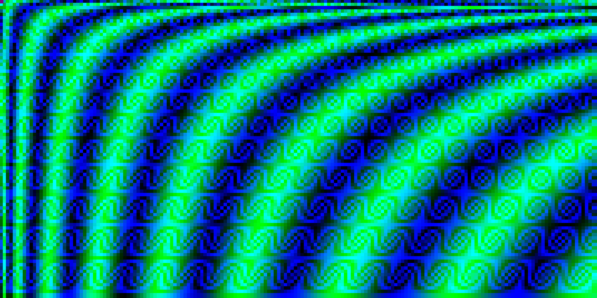
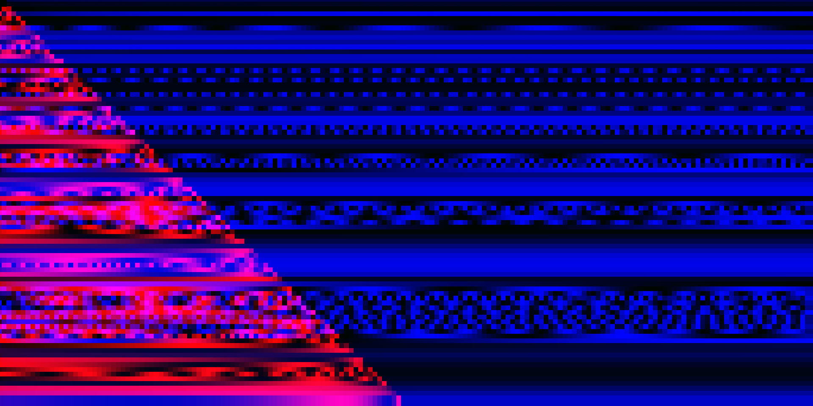
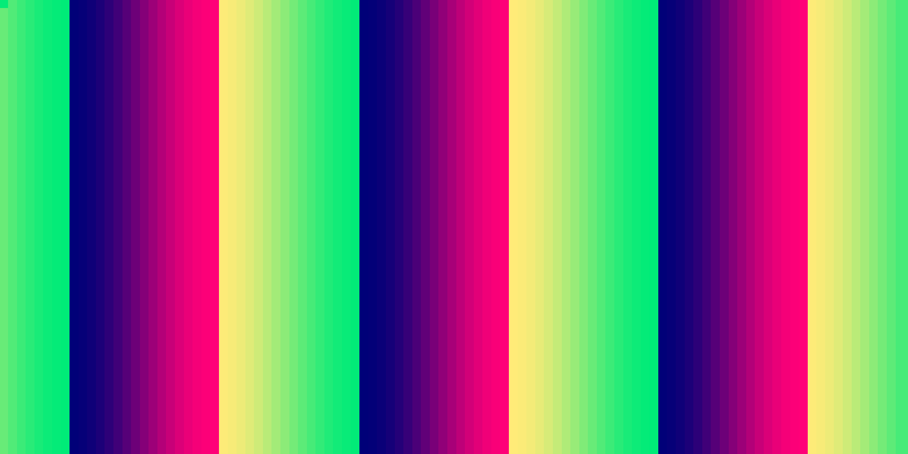
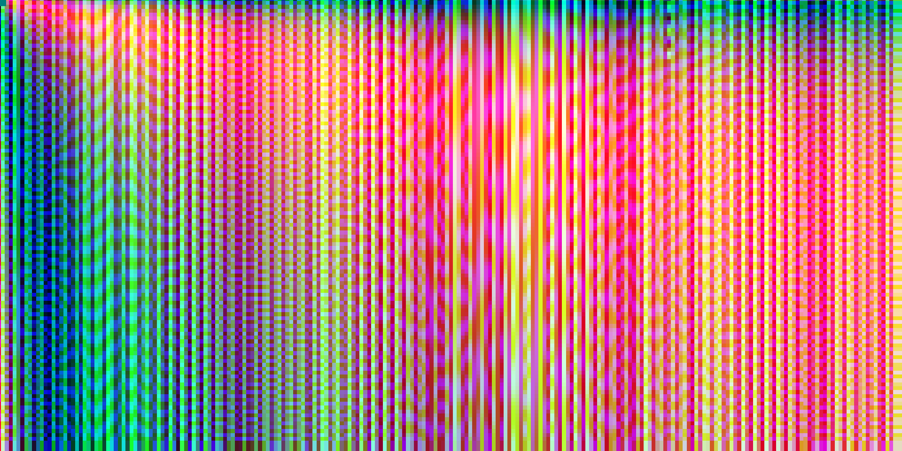
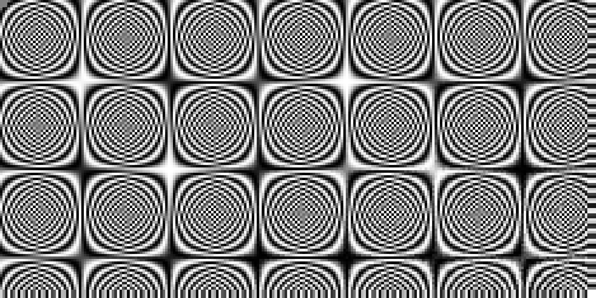

# WoozyGraph

## What is this?
WoozyGraph is a WebGL based simulation game for the creation and display of woozy patterns and graphs.
The principle behind it is very simple:

The user provides a mathematical function for monochrome shading or three mathematical functions for RGB shading.
The function takes three basic variables, `x` `y` and `n`, and these variables can be shaped to create a shading function
that'll decide which color each pixel should be given. The function is injected into a GLSL fragment shader, meaning that
the user has the power of all GLSL functions in their hands, basically making the function a really basic fragment shader ran on big pixels.

The `x` variable is the left to right coordinate of the pixel, the `y` variable is the up to down coordinate of the pixel, and `n` is a uniform animation parameter passed to the shader and can be modified by the user and animated.

One important distinction which the shading function has, is the fact that it's always wrapped in a sine wave.
This wrapping has multiple benefits:
* Range: I can very easily clamp the function between 0 and 1, the GLSL color space range. The sine wave function returns
a number between -1 and 1, so this following forumla yields the desired range: )&plus;1}{2})
* Circularity: The output of the sine function is circular, which yields repeating values even when the `x` and `y` values get very large. This very circularity is the reason for WoozyGraph's unique patterns.

## Great! How do I play this game?
Just play around with the settings, I'm sure you'll find some interesting patterns!
**Left click** the canvas to generate random shader functions.
If you skimmed past many random shaders too fast and missed a cool one, **right click** the canvas to go back.
If you created or found a cool "build" (a combination of settings and functions) click the share link to
copy the build into a URL.

## I'm bored of generating random patterns. How can I make my own?
You don't necessarily need to have a deep knowledge of mathematics to create a cool shader function, just play
around with different [GLSL functions](https://docs.gl/el3/abs) until you get something nice!

## Um, I wrote my own function and the game froze. What happened?
You have an error in your function. The most common ones I encounter myself are forgetting to add a decimal point
to numbers (2 instead of 2.0, for example), and forgetting to close function parenthesis.
If you think the syntax is correct and the game is still frozen, open the console
and see what the reported issue is.

## Ok, cool, how can I mod this game?
Download this repository, and make sure you have `yarn` installed.
Open a terminal window in the repository's folder, then run `yarn` to install
required packages, and then `yarn dev` for live debugging or `yarn build` to build this game into a static website.
Make sure you read the license first, please.